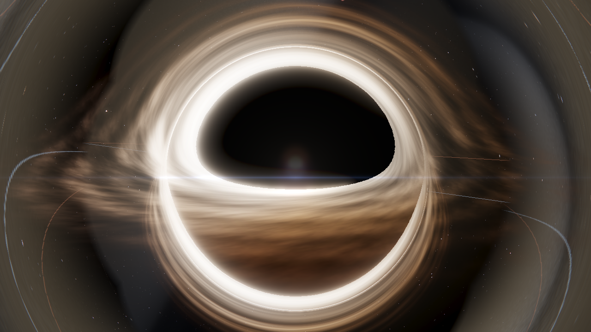
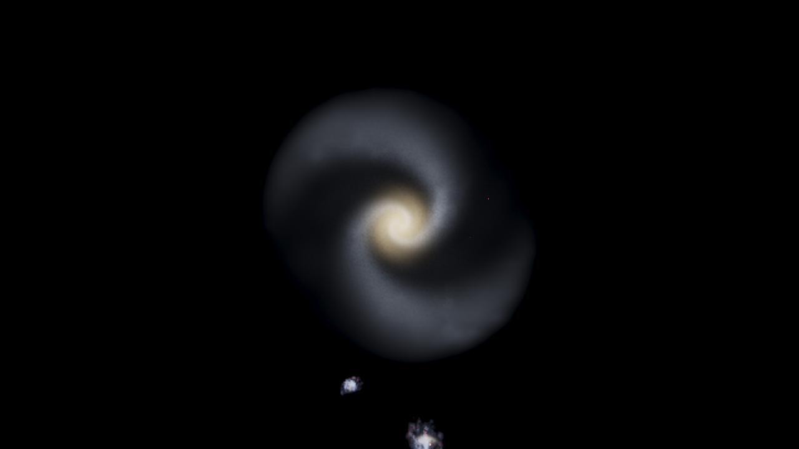
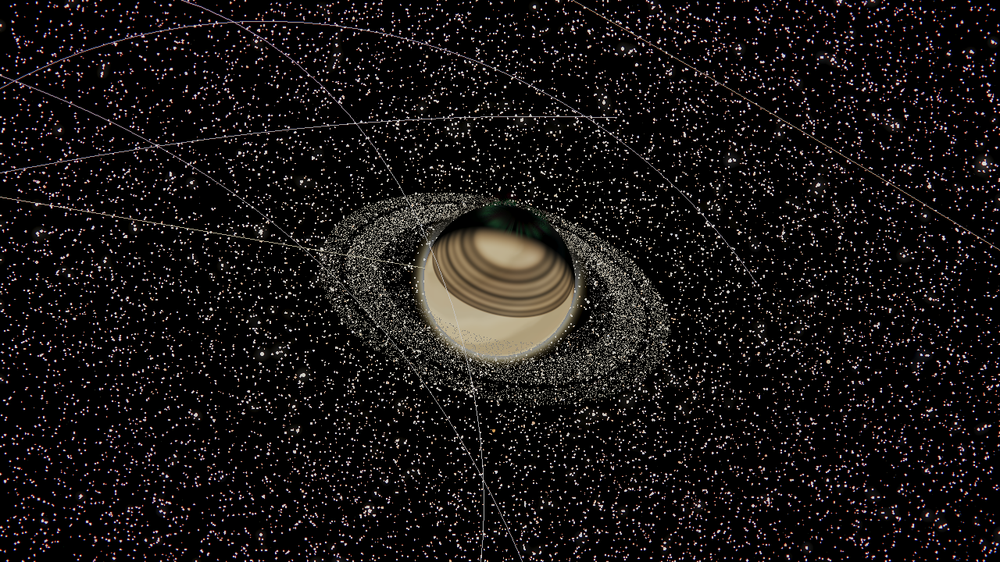
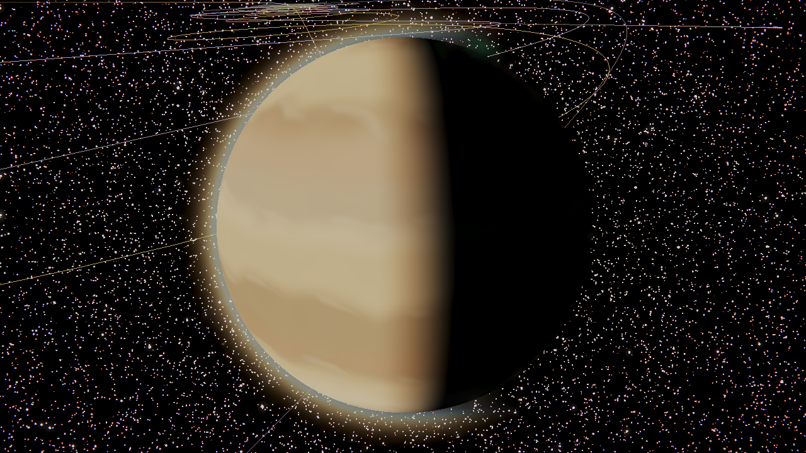
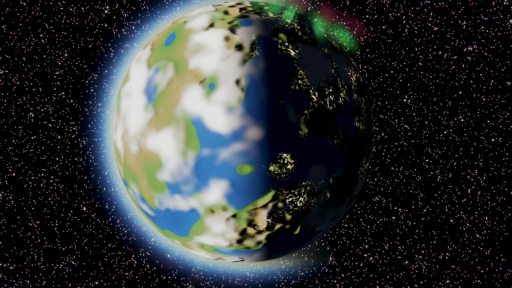
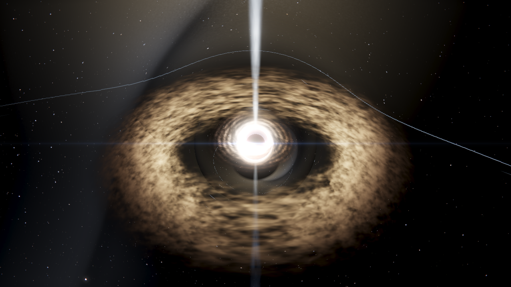
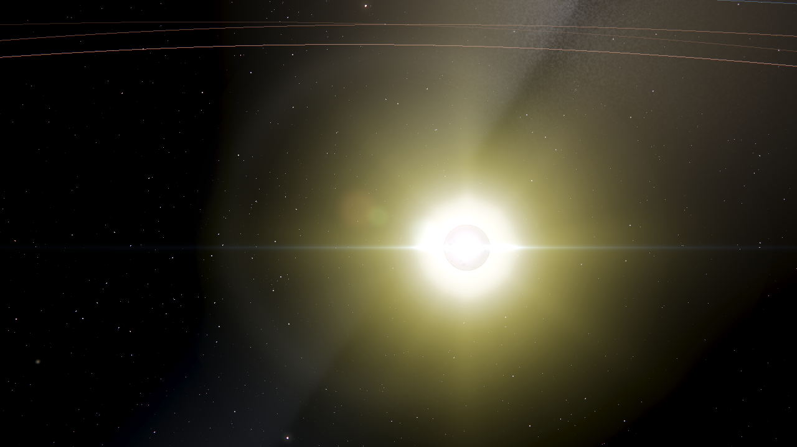
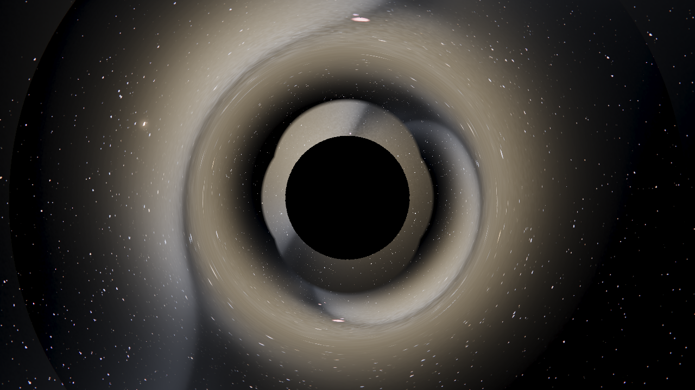
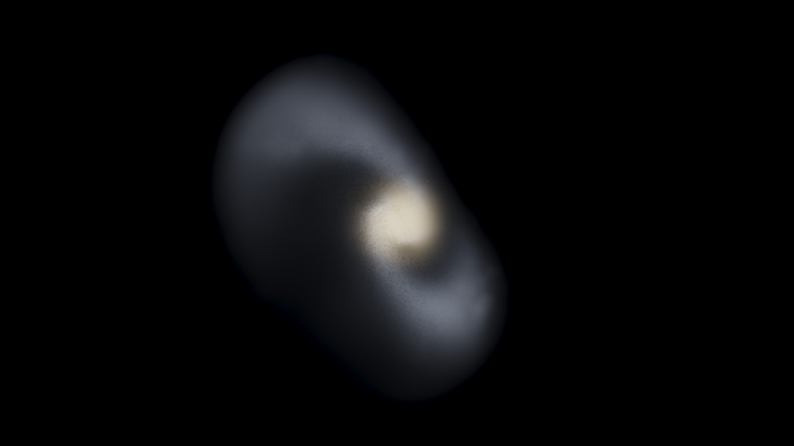
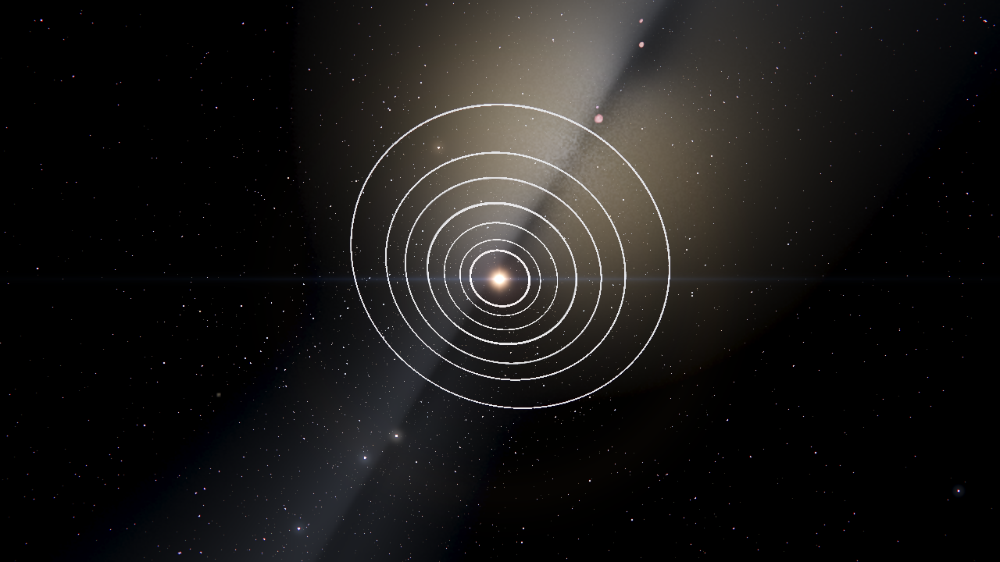

<p align="center">
  
</p>

# OpenMultiVerse

**A real-time, scale-continuous universe simulator with configurable laws of physics.**

OpenMultiVerse simulates the universe from a planet's surface out past the Milky Way — under genuine N-body gravity, populated from real astronomical catalogs, with the laws of physics themselves left as parameters you can rewrite. Fly from Saturn's rings to the galactic disc without a loading screen or a "mode switch," then change the gravitational constant and watch the orbits unravel.

It's written in C99 + OpenGL 3.3. It began as a fork of [ortanaV2/OpenVerse](https://github.com/ortanaV2/OpenVerse) and has grown into its own thing: a *scale-continuous* renderer (planet → system → galaxy → Local Group with no hard boundaries), a stellar lifecycle that ends in white dwarfs, neutron stars and black holes, quasars and blazars with relativistic jets, and a **multiverse** of tunable physical laws.

> Not a screensaver. Not a game. A sandbox for curiosity.

---

## Gallery

<table>
  <tr>
    <td width="50%"><br/><sub><b>The Milky Way from outside</b> — real Gaia stars + a volumetric disc, with satellite galaxies</sub></td>
    <td width="50%"><br/><sub><b>Saturn</b> — a sunlit banded gas giant and its 25,000-particle rings</sub></td>
  </tr>
  <tr>
    <td><br/><sub><b>Jupiter</b> — a sharp terminator across the cloud belts, Galilean moons orbiting</sub></td>
    <td><br/><sub><b>Earth</b> — oceans, clouds, atmospheric scattering, and a night-side aurora</sub></td>
  </tr>
  <tr>
    <td><br/><sub><b>Quasar</b> — a feeding black hole inside its dusty torus, jet blasting out along the axis</sub></td>
    <td><br/><sub><b>A star and its system</b> — orbit trails and a lens flare against the Milky Way band</sub></td>
  </tr>
  <tr>
    <td><br/><sub><b>Black hole</b> — accretion disk warped by gravity into a halo over the event horizon</sub></td>
    <td><br/><sub><b>Gravitational lensing</b> — a bare horizon bending the star field behind it</sub></td>
  </tr>
</table>

---

## What makes it different

- **One continuous world.** No "planet view" vs. "galaxy view." A single renderer spans ~30 orders of magnitude in distance; hold <kbd>W</kbd> and zoom from a moon's surface out past the Milky Way.
- **Real scale, real dynamics.** Every distance, mass, and orbital period is physically accurate, and every body moves under real N-body gravity — no baked animations. Disrupt the Solar System and watch it react.
- **Configurable laws of physics.** Each universe carries a `"laws"` block — change `G`, the force-law exponent, add a cosmological repulsion or post-Newtonian precession — and the dynamics change with it.
- **Built from real catalogs.** Import the NASA Exoplanet Archive, JPL Horizons state vectors, and Gaia/Hipparcos stars. The bundled "Known Universe" merges the Solar System with ~16,000 real bodies.
- **A universe that evolves.** Stars age off the main sequence into giants, white dwarfs, neutron stars and black holes; massive stars go supernova; black holes accrete, light up as quasars, and tidally shred stars that wander too close.
- **Live editing.** A Dear ImGui menu (<kbd>U</kbd>) to switch universes, drag the law sliders in real time, import real data, and snapshot/restore the exact state of a running universe.

---

## How it works

The interesting engineering problem is that space is *mostly empty and unimaginably large*, yet we want it to feel continuous and run in real time. Here's how OpenMultiVerse pulls that off.

### One renderer, every scale

There is no mode switch between "surface," "system," and "galaxy." A single **scale-continuous** renderer covers the whole range using a shared logarithmic depth transform and a continuous level-of-detail crossfade: a body fades smoothly from a **dot** → a lit **sphere** → a **glare/billboard** as you approach or recede, so a star is a pinprick from light-years away and a textured surface up close, with no pop. A background density field (the *CosmicField*) tells the renderer how crowded space is locally and scales the LOD accordingly. The Milky Way is a real home volume centered ~26,000 ly toward Sagittarius A\*, so flying "up" out of the disc reveals the galaxy from outside — and beyond it, the Local Group.

### Everything is SI; the camera makes it renderable

Simulation state is stored in **SI units** — metres, kilograms, seconds — because that's what the physics is written in. The catch: when the camera is light-years from the origin, single-precision floats can't represent positions without jitter. So all geometry is drawn **camera-relative**: the camera position is subtracted from every body *in double precision on the CPU*, and only the small relative offset is cast to float for the GPU (`vp_camrel = proj · view_rot`). The result is rock-steady framing whether you're skimming a ring or parked outside Andromeda.

### How it handles thousands of stars and planets

Running full N-body gravity on ~16,000 bodies at 60 fps takes three ideas working together:

- **Hierarchical RESPA integrator.** Forces are split by timescale: slow star↔planet interactions are integrated on a coarse *outer* timestep, while fast moon↔parent interactions get many small *inner* substeps. Each star system picks its own adaptive timestep from its tightest orbit, so a system with a close-in hot Jupiter doesn't force the whole universe to crawl. Before the first frame, ~2 years are pre-simulated ("warm-up") to settle every system onto its orbit — parallelized across systems with OpenMP.
- **Gravitational isolation.** Interstellar gravity is negligible — the Sun's pull on Alpha Centauri's planets is nothing next to their own star's. So by default each star system gravitates **only within itself**. This turns one intractable *N²* problem over 16,000 bodies into thousands of tiny, independent problems (and, because they're independent, they integrate in parallel).
- **A camera-driven active region.** Only systems within a few light-years of the camera are fully simulated each frame. Everything beyond that **freezes** and is drawn as a cheap **far-field point** — a single static buffer holding the whole Gaia field, culled on the GPU. Walk toward a frozen star and it seamlessly "wakes up" into a live, integrated system with procedural planets.

The upshot: the cost of a frame tracks *what's near you*, not the size of the catalog. The full deep-dive lives in [ARCHITECTURE.md](ARCHITECTURE.md) §8 (physics) and §8.1 (galaxy-scale rendering).

<p align="center">
  <br/>
  <sub>The same catalog, seen from outside: ~16k fully-simulated bodies near the camera, the rest a frozen far-field star field composited into a volumetric galactic disc.</sub>
</p>

### The laws are data

Every universe is a JSON file with an optional `"laws"` block (`src/laws.h`/`laws.c`): the gravitational constant `G`, a Plummer `softening` length, a `force_exp` exponent (2 = inverse-square; try 3), a cosmological `lambda` (dark-energy-like outward push), a `pn_factor` (post-Newtonian perihelion precession), the speed of light `c_light`, and `gravity_isolation`. Omit any field and it falls back to the Newtonian default, so existing universes keep working. Bodies, rings, and asteroid belts are data too — the built-in JSON parser even accepts `//` comments and trailing commas.

---

## Multiverse — different laws of physics

Every universe is a JSON file under `assets/` with an optional `"laws"` block.
Omitted fields fall back to Newtonian defaults, so existing files keep working.

```jsonc
"laws": {
  "G": 6.674e-11,          // gravitational constant (m^3 kg^-1 s^-2)
  "softening": 1e5,        // Plummer softening length (m)
  "time_scale": 1.0,       // multiplier on simulated time
  "force_exp": 2.0,        // radial falloff exponent (2 = inverse-square, 3 = inverse-cube, ...)
  "lambda": 0.0,           // cosmological term: outward push ∝ distance (dark-energy analogue)
  "pn_factor": 0.0,        // post-Newtonian perihelion precession (1 = physical, higher = exaggerated)
  "gravity_isolation": 1.0 // 1 = each system gravitates only within itself (default); 0 = fully coupled
}
```

Bundled example universes live in `assets/universes/`: **Strong Gravity**,
**Inverse-Cube Forces**, **Expanding Cosmos**, **Relativistic Precession**, plus
a **Black Hole** / **Quasar** / **Blazar** family and the galaxy-scale **Known
Universe**. Build with `IMGUI=1` (below) and press <kbd>U</kbd> in-app to pick a
universe or drag the live law sliders and watch the dynamics change.

**Save / load.** The same menu can snapshot the running universe — current laws
plus every body's exact position and velocity — to a JSON file, and load it back
to that precise instant (snapshots skip warm-up so nothing drifts). Handy for
capturing a collision setup or a tweaked law configuration to revisit later.

---

## Real astronomical data

Universes can be built from real catalogs. The converter (`catalogtool`) turns a
catalog into a universe JSON the simulator loads like any other; the same code
also powers the in-app **Import real astronomical data** buttons in the <kbd>U</kbd> menu
(ImGui build), which import a catalog and load it on the spot.

<p align="center">
  <br/>
  <sub>TRAPPIST-1, straight from the NASA Exoplanet Archive: a red dwarf with seven real, tightly-packed planets on Keplerian orbits.</sub>
</p>

```bash
make catalogtool
./catalogtool exoplanets assets/catalogs/exoplanets_sample.csv assets/universes/my_systems.json
./catalogtool horizons   assets/catalogs/horizons_sample.csv   assets/universes/my_solar.json
./catalogtool gaia       assets/catalogs/gaia_sample.csv        assets/universes/my_stars.json [max]
```

| Source | What it reads | Where to get it |
|---|---|---|
| **NASA Exoplanet Archive** | `hostname`, `pl_name`, `sy_dist`, `ra`, `dec`, `st_mass/rad/teff`, `pl_orbsmax`/`pl_orbper`, `pl_orbeccen`, `pl_orbincl`, `pl_bmasse`, `pl_rade` → one star + Keplerian planets per host | [Planetary Systems CSV](https://exoplanetarchive.ipac.caltech.edu/) |
| **JPL Horizons** | heliocentric **Ecliptic of J2000.0** state vectors (`x/y/z_km`, `vx/vy/vz_kms`) → converted to orbital elements | [ssd.jpl.nasa.gov/horizons](https://ssd.jpl.nasa.gov/horizons/) (VECTORS, km & km/s) |
| **Gaia / Hipparcos** | `ra`, `dec`, `parallax` (mas), `pmra`, `pmdec`, `radial_velocity`, `teff` → positioned, drifting stars | [Gaia Archive](https://gea.esac.esa.int/archive/) |

Small real samples live in `assets/catalogs/`, and the bundled presets
**TRAPPIST-1 (real)**, **Stellar Neighborhood (real)**, **Solar System
(Horizons)**, and **Real Stars (Gaia)** are generated from them. The
**Known Universe** preset merges the Solar System with the full NASA Exoplanet +
Gaia catalogs into a single ~16,000-body universe — generate or resize it with
`python3 tools/build_known_universe.py --max-systems N` (`N=0` = everything). See
[ARCHITECTURE.md](ARCHITECTURE.md) §8.1 for how the renderer keeps that many
bodies real-time.

---

## Controls

| Key / Input | Action |
|---|---|
| Left-click | Enter free-look (captures mouse) |
| Escape | Open system menu / exit build mode / exit inspection mode |
| W / S | Move forward / backward |
| A / D | Strafe left / right |
| Q / E | Move down / up |
| Mouse | Look around |
| Scroll | Adjust camera speed |
| T | Toggle warp mode |
| B | Toggle build mode |
| Tab + Scroll | Cycle build presets (in build mode) |
| I | Toggle inspection mode |
| H | Hide / show the HUD overlay and body labels |
| U | Toggle the multiverse menu (requires the ImGui build — see below) |
| F11 / Alt+Enter | Toggle fullscreen |
| `+` / `-` | Simulation speed up / down |
| Space | Pause / resume |
| R | Reset camera near the Sun |

**Simulation speeds:** `0 → 0.1 → 0.25 → 0.5 → 1 → 2 → 5 → 10 → 30 → 60 → 100 → 365` days/s

---

## Feature status

| Feature | Status |
|---|---|
| N-body gravity — RESPA hierarchical integrator, adaptive per-system timestep | ✓ |
| Scale-continuous renderer — planet → system → galaxy → Local Group, no mode switch | ✓ |
| Galaxy-scale performance — camera-driven active region + far-field points, ~16k bodies real-time | ✓ |
| Full Solar System — Sun, 8 planets, dwarf planets, large asteroids, and major moons | ✓ |
| Procedural planet textures, atmospheres (scattering, day/night), axial tilt & rotation | ✓ |
| Ring systems — Saturn (Keplerian particles), Uranus & Neptune | ✓ |
| Asteroid belts — Main Belt & Kuiper Belt with gravity-integrated particles | ✓ |
| Comets — coma + ion/dust tails at perihelion | ✓ |
| Planet collision & merge — particle spray, persistent craters, spin transfer | ✓ |
| Stellar lifecycle — main-sequence → giant → white dwarf / neutron star / black hole | ✓ |
| Supernovae | ✓ |
| Black holes — raymarched accretion disk, shadow, photon ring & gravitational lensing | ✓ |
| Active galactic nuclei — quasars, blazars, relativistic jets, tidal disruption | ✓ |
| Volumetric nebulae & the Milky Way disc; HDR bloom | ✓ |
| Data-driven physical laws — per-universe G, softening, force law, Λ, post-Newtonian, isolation | ✓ |
| Multiverse menu — universe picker + live law sliders (optional `IMGUI=1` build) | ✓ |
| Real-data import — NASA Exoplanet / JPL Horizons / Gaia, in-app and via `catalogtool` | ✓ |
| Build mode & inspection mode — spawn bodies, highlight and orbit targets | ✓ |
| Save / load — snapshot & restore exact universe state | ✓ |

---

## Installation

> **No prebuilt binaries are published yet.** OpenMultiVerse currently builds from
> source (below) — it's a quick `make` on Linux, and the multiverse menu is an
> optional `IMGUI=1` build. Packaged releases may come later.

---

## Building from Source

**Linux**
```bash
sudo apt install build-essential libsdl2-dev libsdl2-ttf-dev libsdl2-mixer-dev libglew-dev
make
./verse
```
(On Arch/CachyOS: `sudo pacman -S sdl2 sdl2_ttf sdl2_mixer glew`.)

**Windows (MSYS2 / MinGW-w64)**
```bash
pacman -S mingw-w64-x86_64-gcc mingw-w64-x86_64-make \
          mingw-w64-x86_64-SDL2 mingw-w64-x86_64-SDL2_ttf \
          mingw-w64-x86_64-SDL2_mixer mingw-w64-x86_64-glew
mingw32-make
./verse.exe
```

**Optional — the ImGui multiverse menu**

The universe picker and live law sliders are built on [cimgui](https://github.com/cimgui/cimgui)
(a C binding for Dear ImGui) and are compiled only on request:

```bash
git submodule update --init --recursive   # fetch extern/cimgui + Dear ImGui
make IMGUI=1                               # links libstdc++; needs g++
./verse                                    # press U for the multiverse menu
```

Without `IMGUI=1` the menu code compiles to inert stubs and the simulator builds
exactly as before (no C++ toolchain or cimgui required). Universes can still be
selected by editing the path the app loads. Toggling `IMGUI` on or off requires a
`make clean` first.

**Headless rendering.** The screenshots in this README were rendered offscreen on
the GPU — no window needed — via `tools/shot.sh out.png --preset <universe> --cam
x,y,z,yaw,pitch`. Useful shot flags: `--no-hud` (hide the overlay + labels),
`--timescale 0` (freeze the sim so close-range framing is reproducible), `--fov`
(narrow for telephoto framing), `--exposure` (fix exposure so bright star fields
don't wash out the subject), and `--stellar-rate` (run stellar evolution to catch
lifecycle events). In-app, press <kbd>H</kbd> to toggle the HUD.

For a full technical reference of the codebase, see [ARCHITECTURE.md](ARCHITECTURE.md).

---

## Contributing

OpenMultiVerse is open source and early in development. The physics engine, rendering pipeline, and coordinate system are all designed to scale beyond a single solar system — and beyond a single set of physical laws. If you want to help push toward a truly open multiverse, contributions are welcome.

See [CONTRIBUTING.md](CONTRIBUTING.md) for guidelines on reporting bugs, requesting features, and submitting pull requests.

---

## License

This project is licensed under the [MIT License](LICENSE).
