<p align="center">
  <a href="https://www.youtube.com/watch?v=9ynOgH23AT4">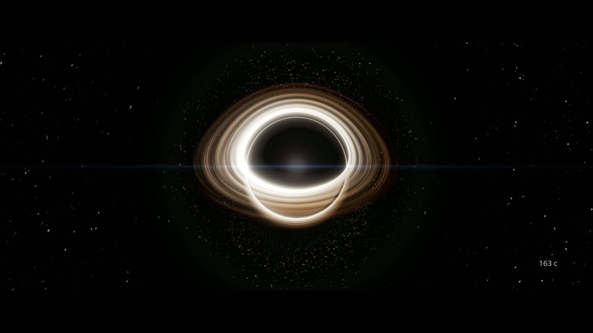</a>
</p>

<h1 align="center">OpenMultiVerse</h1>

<p align="center">
  <b>A real-time, scale-continuous universe simulator with configurable laws of physics.</b><br/>
  <sub>
    <a href="https://www.youtube.com/watch?v=9ynOgH23AT4">▶ Showcase film (4K, YouTube)</a> ·
    <a href="showcase.mp4">▶ Showcase film (1080p, in repo)</a> ·
    <a href="#quick-start">Quick start</a> ·
    <a href="#cinematic-renderer">Cinematic renderer</a> ·
    <a href="#real-astronomical-data">Real data</a>
  </sub>
</p>

OpenMultiVerse simulates the universe from a planet's surface out past the Milky Way. Bodies move under N-body gravity, the sky is populated from real astronomical catalogs, and the laws of physics are parameters you can rewrite. You can fly from Saturn's rings to the galactic disc with no loading screen or mode switch, then change the gravitational constant and watch the orbits come apart.

It's written in C99 and OpenGL 3.3. It began as a fork of [ortanaV2/OpenVerse](https://github.com/ortanaV2/OpenVerse) and now has its own features:
- a **scale-continuous** renderer that goes from planet to system to galaxy to Local Group with no hard boundaries;
- a **stellar lifecycle** that ends in white dwarfs, neutron stars and black holes;
- **quasars and blazars** with relativistic jets;
- a **cinematic renderer** that films the simulation headless;
- a **multiverse** of tunable physical laws.

> Not a screensaver. Not a game. A sandbox for curiosity.

The showcase film above is one continuous camera move outward from Earth, past Saturn, the Solar System, Alpha Centauri, the Lagoon Nebula and Sagittarius A\*, ending on the Milky Way seen face-on. The built-in cinematic renderer produced it headless from [`assets/shots/showcase.json`](assets/shots/showcase.json).

---

## Gallery

These stills come from the cinematic renderer as it flies the built-in benchmark tour, a single trip from the Sun to the most massive black hole known. Every frame is the live simulation with the camera placed on a real catalogued object. None of them are hand-composited.

<table>
  <tr>
    <td width="50%">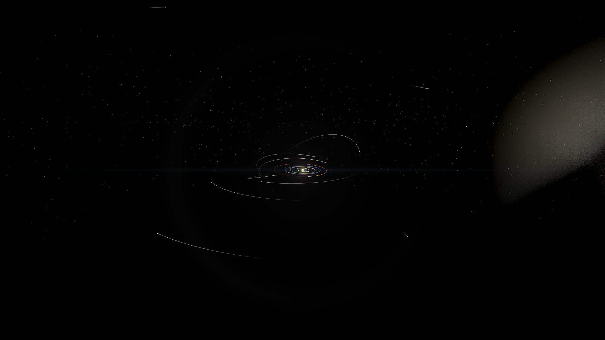<br/><sub><b>The Solar System</b> · ~17 AU. The Sun and planets on their integrated orbits.</sub></td>
    <td width="50%">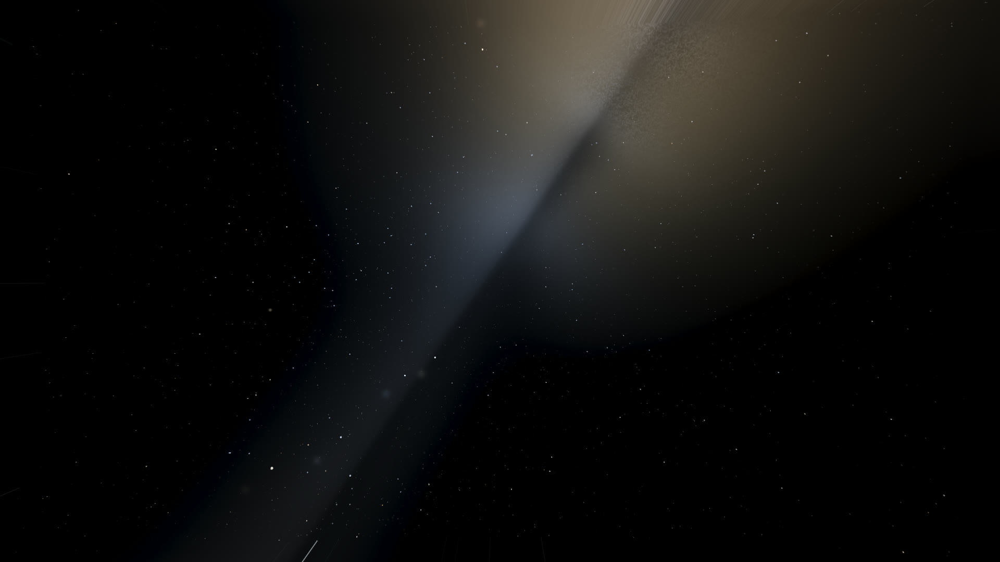<br/><sub><b>Solar neighbourhood</b> · ~65 ly. Real Gaia stars against the glow of the galactic disc.</sub></td>
  </tr>
  <tr>
    <td>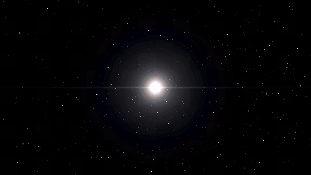<br/><sub><b>Supernova</b>, live. HD 17092 (6.7 M☉) collapses on camera and its ejecta swell outward. Rendered from <a href="assets/shots/supernova.json"><code>supernova.json</code></a>.</sub></td>
    <td>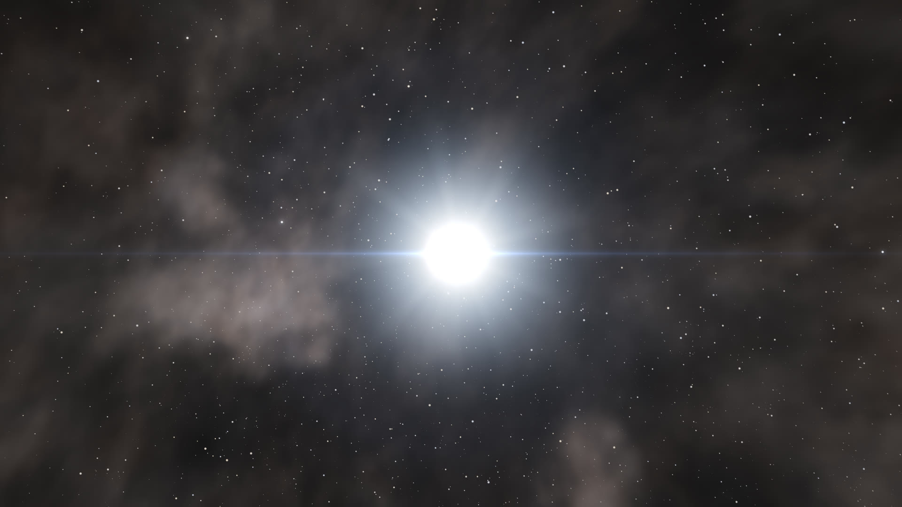<br/><sub><b>Neutron star</b>. The remnant a stellar death leaves behind.</sub></td>
  </tr>
  <tr>
    <td>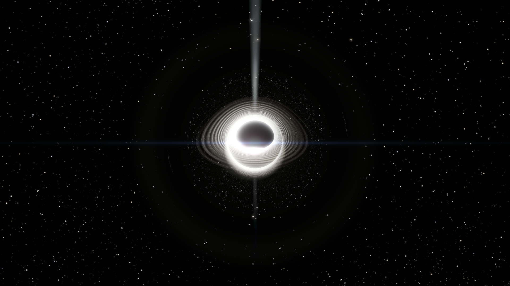<br/><sub><b>Cygnus X-1</b> · 21 M☉. A stellar-mass black hole: its disk is lensed over the shadow and bends the star field behind it.</sub></td>
    <td>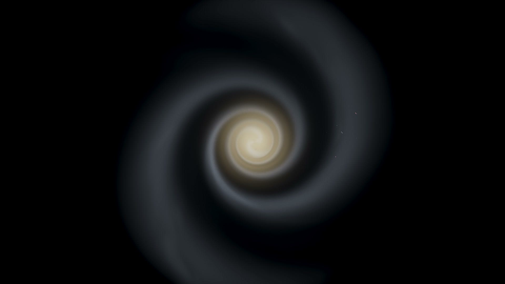<br/><sub><b>The Milky Way</b>, face-on · ~80,000 ly out. A volumetric disc, framed as the showcase film ends.</sub></td>
  </tr>
  <tr>
    <td>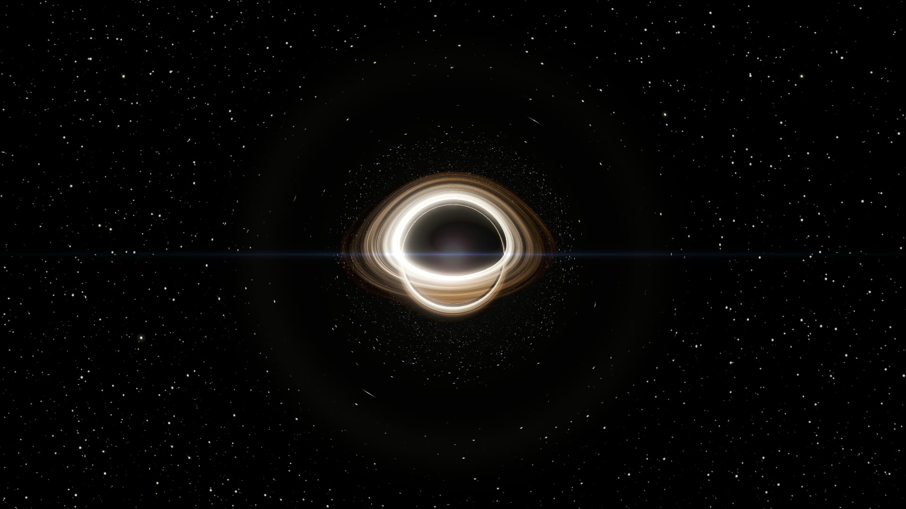<br/><sub><b>Sagittarius A\*</b> · 4.15 million M☉. The black hole at the centre of our galaxy.</sub></td>
    <td>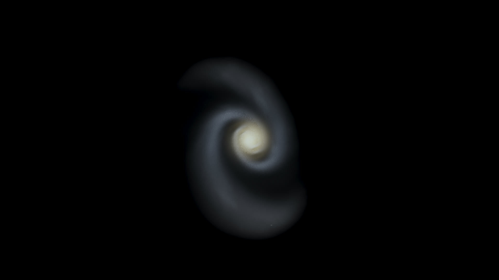<br/><sub><b>Andromeda (M31)</b> · 2.5 million ly. Our nearest large neighbour.</sub></td>
  </tr>
  <tr>
    <td>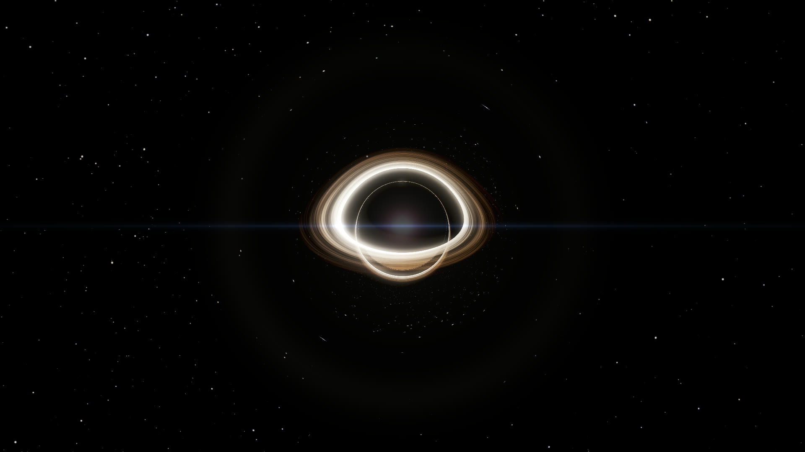<br/><sub><b>M31\*</b>. Andromeda's own nucleus, a supermassive hole inside its host galaxy.</sub></td>
    <td>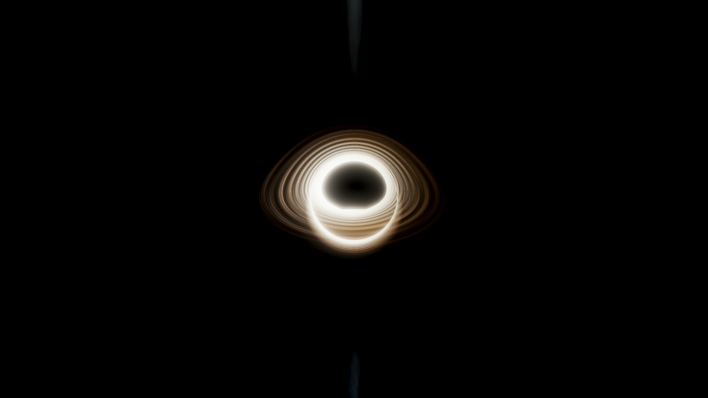<br/><sub><b>M87\*</b> · 6.5 billion M☉. The first black hole ever imaged, with its jet.</sub></td>
  </tr>
  <tr>
    <td>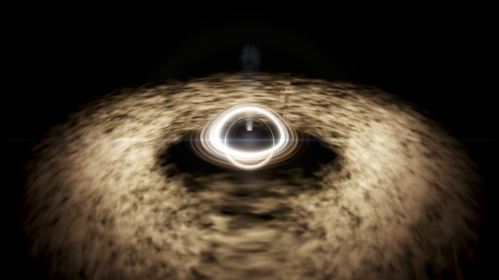<br/><sub><b>3C 273</b> · 2.4 billion ly. A quasar: an accretion disk inside a dust torus, with jets.</sub></td>
    <td>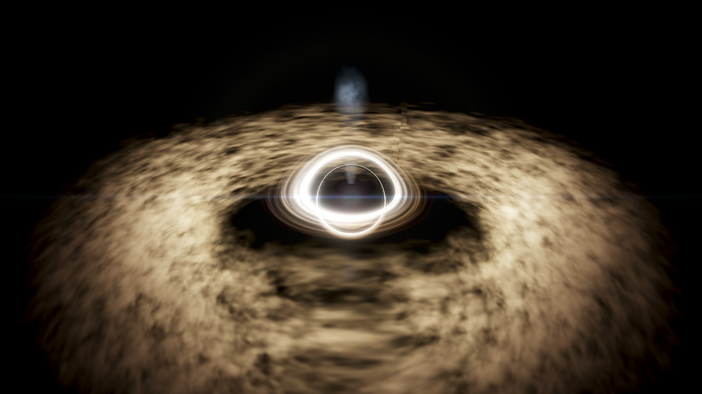<br/><sub><b>TON 618</b> · ~40 billion M☉. The heaviest black hole in the catalog.</sub></td>
  </tr>
</table>

---

## What makes it different

- **One continuous world.** There is no separate planet view or galaxy view. A single renderer spans about 30 orders of magnitude in distance. Hold <kbd>W</kbd> and zoom from a moon's surface out past the Milky Way.
- **Real scale, real dynamics.** Distances, masses and orbital periods are physical, and every body moves under N-body gravity. Nothing is a baked animation, so if you disrupt the Solar System it reacts.
- **Configurable laws of physics.** Each universe carries a `"laws"` block. You can change `G` or the force-law exponent, or add cosmological repulsion or post-Newtonian precession, and the dynamics follow.
- **Built from real catalogs.** It reads NASA Exoplanet Archive, JPL Horizons, Gaia DR3, Hipparcos and Tycho-2 data. The bundled Known Universe has **~210,000 modelled bodies** and **~277,000 Gaia field stars** around a real Earth.
- **A universe that evolves.** Stars age off the main sequence into giants, white dwarfs, neutron stars and black holes. Massive stars go supernova. Black holes accrete, light up as quasars, and tear apart stars that come too close.
- **It films itself.** `--cinematic --output film.mp4` renders a deterministic, motion-blurred, depth-of-field film offscreen. You can script the camera with keyframes or let a procedural tour and auto-director choose the shots.
- **Live editing.** A Dear ImGui menu (<kbd>U</kbd>) switches universes, drags the law sliders in real time, imports real data, and saves or restores the exact state of a running universe.

---

## Quick start

```bash
# Arch / CachyOS
sudo pacman -S sdl2 sdl2_ttf sdl2_mixer glew ffmpeg
# Debian / Ubuntu
sudo apt install build-essential libsdl2-dev libsdl2-ttf-dev libsdl2-mixer-dev libglew-dev ffmpeg

git clone --recursive https://github.com/MrBlackReal/OpenMultiVerse.git
cd OpenMultiVerse
make -j
./verse
```

`./verse` opens the **Known Universe** with the camera near the Sun. Click to capture the mouse, fly with <kbd>W</kbd><kbd>A</kbd><kbd>S</kbd><kbd>D</kbd> + <kbd>Q</kbd>/<kbd>E</kbd>, change speed with the scroll wheel, and press <kbd>T</kbd> to warp. <kbd>U</kbd> opens the multiverse menu. Some other things to try:

```bash
./verse --preset assets/universes/quasar.json      # a single quasar, up close
./verse --cinematic                                 # same app, cinematic renderer
./verse --benchmark                                 # scripted tour + FPS report
./verse --cinematic --draft --output tour.mp4       # film a 30 s procedural tour (720p preview)
```

`ffmpeg` is only needed for film-out. Full build options, including Windows, are in [Building from source](#building-from-source).

---

## Cinematic renderer

`--cinematic` replaces the realtime renderer with an **accumulation-sampled** one. Each output frame averages many sub-frames, each rendered with a slightly different shutter time, lens position and pixel jitter. From that one mechanism you get correct motion blur, physically based depth of field, supersampled antialiasing and long-exposure star trails, and none of them are screen-space approximations.

It has two modes:

| Mode | Command | What happens |
|---|---|---|
| **Live** | `./verse --cinematic` | Same window, free-look camera and menus. Only the renderer changes (4 samples per frame). |
| **Film-out** | `./verse --cinematic --output film.mp4` | Headless and deterministic, with a fixed timestep decoupled from the wall clock. Frames are piped to ffmpeg, so the same command always produces the same film. |

**Where the camera comes from.** You can give it a keyframed **shot script** (`--shot-script assets/shots/*.json`). Otherwise it flies a **procedural tour** of the loaded universe, and an **auto-director** cuts away to whatever the simulation is doing: supernovae, collisions, mergers and close approaches. The scripts are plain JSON: keyframes carry time, position, look-at target, FOV and focus. Positions can be anchored to named bodies, so the camera follows a planet along its orbit. The ImGui panel can drop keyframes from the live camera and scrub the result.

```bash
# the showcase film, exactly as published
./verse --cinematic --output showcase.mp4 --shot-script assets/shots/showcase.json

# a 4K, 24 fps, 64-sample render with a shallow lens and titles
./verse --cinematic --film --output m87.mp4 --shot-script my_shot.json \
        --aperture 2.8 --focus "M87*" --cinematic-info

# quick look before committing to a long render
./verse --cinematic --draft --output preview.mp4 --duration 10
```

| Flag | Effect |
|---|---|
| `--res WxH` · `--fps N` · `--duration S` | Output spec (default 1920×1080, 60 fps, 30 s; a shot script sets its own length) |
| `--samples N` | Sub-frames per output frame (default 32 when filming) |
| `--film` · `--draft` | Presets: 4K/24 fps/64 samples, or 720p/30 fps/4 samples |
| `--shutter DEG` | Shutter angle, i.e. motion-blur length (default 180°, 0 = off) |
| `--aperture F` · `--focus NAME\|AU\|auto` | Depth of field. Focus can rack onto a named, moving body |
| `--grain V` · `--letterbox [AR]` | Film grain; matte bars (bare = 2.39:1) |
| `--cinematic-info` | Title cards (name, distance, date, scale bar). Output is clean by default |
| `--audio PATH` · `--no-audio` | Soundtrack to mux (default `assets/soundtrack.ogg`) |
| `--tour` · `--director` | Procedural tour only, or event cutaways only |

The look layer also has a lens that scales to the scene, star-veil glare when a bright star is near the frame, and 16K Earth day/night imagery for low passes. The full design (accumulation maths, time model, encoder path, shot-script format, and how to author a watchable shot) is in **[CINEMATIC.md](docs/CINEMATIC.md)**.

> **Film-out is heavy.** It uses every core and the GPU. Start with `--draft` or a short `--duration`, and cap threads with `OMP_NUM_THREADS=4 nice -n 19 ./verse …` if you're working on the same machine.

**Regenerating the gallery.** Most stills come from the benchmark tour. The supernova loop is its own shot, which detonates the star on cue with a `"detonate"` key. The Milky Way is framed at the showcase's closing keyframe. Its spiral winds up as the film runs, so match the showcase by holding that keyframe for ~88 s.

```bash
./verse --headless --cinematic --no-hud --res 1920x1080 --benchmark --benchmark-shots shots
./verse --cinematic --output supernova.mp4 --shot-script assets/shots/supernova.json \
        --res 1280x720 --fps 20 --samples 16 --no-audio
```

---

## How it works

Space is *mostly empty and unimaginably large*, yet the simulator has to feel continuous and run in real time. Here's how OpenMultiVerse manages that.

### One renderer, every scale

There is no mode switch between surface, system and galaxy. One **scale-continuous** renderer covers the whole range using a shared logarithmic depth transform and a continuous level-of-detail crossfade. As you approach or recede, a body fades smoothly from a **dot** to a lit **sphere** to a **glare/billboard**. A star is a pinprick from light-years away and a textured surface up close, and it never pops. A background density field (the *CosmicField*) tells the renderer how crowded space is locally and scales the LOD to match. The Milky Way is a real volume centred ~26,000 ly toward Sagittarius A\*, so flying "up" out of the disc shows the galaxy from outside, and beyond it the Local Group.

### Everything is SI; the camera makes it renderable

Simulation state is stored in **SI units** (metres, kilograms, seconds) because that's what the physics is written in. The catch is that when the camera is light-years from the origin, single-precision floats can't represent positions without jitter. So all geometry is drawn **camera-relative**. The camera position is subtracted from every body *in double precision on the CPU*, and only the small relative offset is cast to float for the GPU (`vp_camrel = proj · view_rot`). Framing stays rock-steady whether you're skimming a ring or parked outside Andromeda.

### How it handles half a million stars

The Known Universe loads **~210,000 fully modelled bodies** and **~277,000 Gaia field stars**. The bodies are the Solar System, nearby Gaia stars, and every NASA Exoplanet Archive host with its planets. It was developed on a ThinkPad with integrated graphics, and three ideas keep it interactive:

- **Hierarchical RESPA integrator.** Forces are split by timescale. Slow star↔planet interactions run on a coarse *outer* timestep, and fast moon↔parent interactions get many small *inner* substeps. Each star system picks its own adaptive timestep from its tightest orbit, so a close-in hot Jupiter doesn't force the whole universe to crawl.
- **Gravitational isolation.** Interstellar gravity is negligible, so by default each star system gravitates **only within itself**. One intractable *N²* problem becomes thousands of tiny independent ones, and because they're independent they integrate in parallel with OpenMP.
- **A camera-driven active region.** Only systems near the camera are fully simulated each frame. Everything beyond that **freezes** and is drawn as a cheap **far-field point**: one static buffer holding the whole Gaia field, culled on the GPU. Fly toward a frozen star and it "wakes up" into a live, integrated system.

As a result, the cost of a frame depends on *what's near you*, not on the size of the catalog. For the full deep-dive, see [ARCHITECTURE.md](docs/ARCHITECTURE.md) §8 (physics) and §10 (rendering).

### The laws are data

Every universe is a JSON file with an optional `"laws"` block (`src/core/laws.h`/`laws.c`). Omit any field and it falls back to the Newtonian default, so existing universes keep working. Bodies, rings and asteroid belts are data too, and the built-in JSON parser accepts `//` comments and trailing commas.

---

## Multiverse: different laws of physics

```jsonc
"laws": {
  "G": 6.674e-11,          // gravitational constant (m^3 kg^-1 s^-2)
  "softening": 1e5,        // Plummer softening length (m)
  "time_scale": 1.0,       // multiplier on simulated time
  "force_exp": 2.0,        // radial falloff exponent (2 = inverse-square, 3 = inverse-cube, ...)
  "lambda": 0.0,           // cosmological term: outward push ∝ distance (dark-energy analogue)
  "pn_factor": 0.0,        // post-Newtonian perihelion precession (1 = physical, higher = exaggerated)
  "gravity_isolation": 1.0 // 1 = each system gravitates only within itself (default); 0 = fully coupled
}
```

Example universes live in `assets/universes/`: **Strong Gravity**, **Inverse-Cube Forces**, **Expanding Cosmos** and **Relativistic Precession**; a **Black Hole**, **Black Hole Zoo**, **Microquasar**, **Quasar** and **Blazar** family; star-cluster demos; and the galaxy-scale **Known Universe**. Press <kbd>U</kbd> in-app to pick one, or drag the live law sliders and watch the dynamics change.

**Save / load.** The same menu can save a snapshot of the running universe: the current laws plus every body's exact position and velocity. Loading it restores that precise instant, and snapshots skip warm-up so nothing drifts.

---

## Real astronomical data

The Known Universe is assembled from public catalogs, and each source keeps its own role:

| Source | Becomes | Where it comes from |
|---|---|---|
| **JPL Horizons** | The Solar System: planets, dwarf planets, large asteroids, major moons from J2000 state vectors | [ssd.jpl.nasa.gov/horizons](https://ssd.jpl.nasa.gov/horizons/) |
| **NASA Exoplanet Archive** | Every confirmed host star and its planets, on Keplerian orbits at their true positions | [exoplanetarchive.ipac.caltech.edu](https://exoplanetarchive.ipac.caltech.edu/) (TAP) |
| **Gaia DR3**, nearby | Stars that become full, simulated bodies | [Gaia Archive](https://gea.esac.esa.int/archive/) (TAP) |
| **Gaia DR3**, field | ~277k far-field scenery stars with real positions, colours and proper motions | [Gaia Archive](https://gea.esac.esa.int/archive/) (TAP) |
| **Hipparcos / Tycho-2** | Bright-star and fainter optical backfill, cross-matched against Gaia so no star appears twice | [CDS VizieR](https://vizier.cds.unistra.fr/) |
| **Curated black holes** | Galactic stellar-mass holes, Sgr A\*, and famous SMBHs/quasars (M87\*, 3C 273, TON 618, …) | `assets/catalogs/black_holes.csv` |
| **NASA Blue Marble / Black Marble** | Earth's 16K day and 8K night surface imagery | `assets/textures/earth/` |

<p align="center">
  <br/>
  <sub>TRAPPIST-1, taken straight from the NASA Exoplanet Archive: a red dwarf with seven real, tightly packed planets.</sub>
</p>

**The shipped build.** The finished catalogs are committed as compact binaries, so a fresh clone runs the full universe without downloading anything:

- `assets/universes/known_universe.json` is a small, readable manifest with the laws, the Solar System and the curated black holes.
- `assets/catalogs/known_universe_bodies.bin` (*BodyBin*) holds the ~210k catalog bodies.
- `assets/catalogs/gaia_stars.bin` (*StarBin*, ~40 bytes per star against ~400 in JSON) holds the field stars.

**Rebuilding it from source catalogs.** The full CSVs aren't in the repo. Fetch them from the archives' query APIs and rebuild:

```bash
make catalogtool
python3 tools/fetch_catalogs.py            # NASA Exoplanet + Gaia DR3 + Hipparcos/Tycho-2 → assets/catalogs/*_full.csv
python3 tools/build_known_universe.py      # → known_universe.json + known_universe_bodies.bin
```

`build_known_universe.py --max-systems N` builds a smaller slice (`N=0` means everything). Duplicate stars across sources are dropped, and the first occurrence wins.

**Your own universes.** `catalogtool` converts a single catalog into a universe JSON. The same code drives the in-app **Import real astronomical data** buttons in the <kbd>U</kbd> menu.

```bash
./catalogtool exoplanets assets/catalogs/exoplanets_sample.csv assets/universes/my_systems.json
./catalogtool horizons   assets/catalogs/horizons_sample.csv   assets/universes/my_solar.json
./catalogtool gaia       assets/catalogs/gaia_sample.csv        assets/universes/my_stars.json [max]
```

The small real samples in `assets/catalogs/` generate the bundled **TRAPPIST-1 (real)**, **Stellar Neighborhood (real)**, **Solar System (Horizons)** and **Real Stars (Gaia)** presets.

---

## Controls

| Key / Input | Action |
|---|---|
| Left-click | Enter free-look (captures mouse) |
| Escape | Open system menu / exit build mode / exit inspection mode |
| W / S · A / D · Q / E | Forward / back · strafe · down / up |
| Mouse · Scroll | Look around · adjust camera speed |
| T | Toggle warp mode |
| B · Tab + Scroll | Toggle build mode · cycle build presets |
| I | Toggle inspection mode |
| H | Hide / show the HUD overlay and body labels |
| U | Multiverse menu (ImGui build) |
| F11 / Alt+Enter | Toggle fullscreen |
| `+` / `-` · Space | Simulation speed up / down · pause |
| R | Reset camera near the Sun |

**Simulation speeds:** `0 → 0.1 → 0.25 → 0.5 → 1 → 2 → 5 → 10 → 30 → 60 → 100 → 365` days/s

---

## Feature status

| Feature | Status |
|---|---|
| N-body gravity: RESPA hierarchical integrator, adaptive per-system timestep | ✓ |
| Scale-continuous renderer: planet → system → galaxy → Local Group, no mode switch | ✓ |
| Galaxy-scale performance: active region + far-field points, ~490k objects in real time | ✓ |
| Full Solar System: Sun, 8 planets, dwarf planets, large asteroids and major moons | ✓ |
| Earth from real 16K day / 8K night imagery; procedural textures and atmospheres elsewhere | ✓ |
| Ring systems: Saturn (Keplerian particles), Uranus and Neptune | ✓ |
| Asteroid belts, comets (coma + ion/dust tails), collisions with craters and merges | ✓ |
| Stellar lifecycle and live supernovae | ✓ |
| Black holes: raymarched Schwarzschild geodesics, photon ring, background lensing | ✓ |
| Active galactic nuclei: quasars, blazars, relativistic jets, tidal disruption | ✓ |
| Volumetric nebulae, galaxies and the Milky Way disc; HDR bloom | ✓ |
| Cinematic renderer: film-out, motion blur, DoF, shot scripts, tour + auto-director | ✓ |
| Data-driven physical laws and the live multiverse menu | ✓ |
| Real-data import: NASA Exoplanet / JPL Horizons / Gaia, in-app and via `catalogtool` | ✓ |
| Build mode, inspection mode, save / load | ✓ |
| Benchmark tour with per-stage FPS report and frame profiler (`--profile`) | ✓ |

---

## Building from source

> **No prebuilt binaries yet.** OpenMultiVerse builds from source with a quick `make`.

**Linux**
```bash
sudo apt install build-essential libsdl2-dev libsdl2-ttf-dev libsdl2-mixer-dev libglew-dev ffmpeg
# Arch / CachyOS: sudo pacman -S sdl2 sdl2_ttf sdl2_mixer glew ffmpeg
git submodule update --init --recursive   # fetch extern/cimgui + Dear ImGui
make -j
./verse
```

**Windows (MSYS2 / MinGW-w64)**
```bash
pacman -S mingw-w64-x86_64-gcc mingw-w64-x86_64-make \
          mingw-w64-x86_64-SDL2 mingw-w64-x86_64-SDL2_ttf \
          mingw-w64-x86_64-SDL2_mixer mingw-w64-x86_64-glew
git submodule update --init --recursive
mingw32-make
./verse.exe
```

The universe picker and live law sliders are built on [cimgui](https://github.com/cimgui/cimgui), a C binding for Dear ImGui. That's why the default build needs the submodule and a C++ compiler (it links `libstdc++`).

**Without the menu:** `make IMGUI=0` needs no cimgui and no C++ toolchain. `menu.c` then compiles to inert stubs. Switching `IMGUI` either way needs a `make clean` first, because the object files aren't compatible across the switch.

**Headless stills.** `tools/shot.sh out.png --preset <universe> --cam x,y,z,yaw,pitch` renders offscreen on the GPU with no window. Useful flags:
- `--no-hud`: clean frame.
- `--timescale 0`: freeze the sim so framing is reproducible.
- `--fov`: telephoto.
- `--exposure`: fixed exposure.
- `--stellar-rate`: speed up stellar evolution to catch lifecycle events.
- `--cinematic`: accumulation-sampled look.
- `--res WxH`: output size.

For a full technical reference of the codebase, see [ARCHITECTURE.md](docs/ARCHITECTURE.md), and for navigating the large source files, [docs/MODULE_MAP.md](docs/MODULE_MAP.md).

---

## Contributing

OpenMultiVerse is open source and early in development. The physics engine, rendering pipeline and coordinate system are all designed to scale beyond a single solar system, and beyond a single set of physical laws. If you want to help push toward a truly open multiverse, contributions are welcome.

See [CONTRIBUTING.md](docs/CONTRIBUTING.md) for guidelines on reporting bugs, requesting features and submitting pull requests.

---

## License

This project is licensed under the [MIT License](LICENSE.md).
